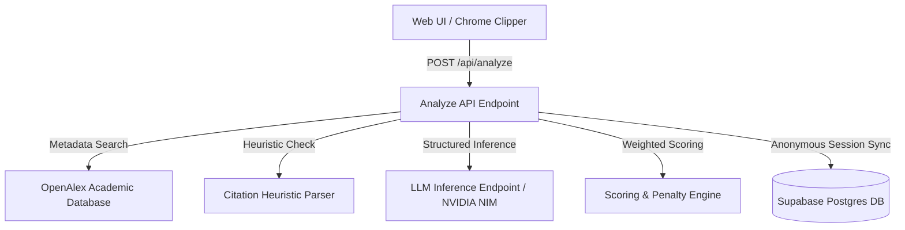

# CutBase Technical Architecture Specification

This document details the system design, algorithmic scoring formulas, and architectural heuristics of the CutBase argument-quality evaluation engine. 

---

## 1. System Topology

CutBase is built on a modern serverless architecture designed for low-latency assessment of textual evidence.

---

## 2. Evidence Scoring Methodology

Readiness score calculation combines semantic analysis from generative models with deterministic heuristics.

### The Scoring Equation
The primary score is a weighted sum of five core dimensions:

\[S_{base} = 0.25 \cdot C_{source} + 0.30 \cdot F_{claim} + 0.15 \cdot R_{recency} + 0.15 \cdot S_{specificity} + 0.15 \cdot I_{integrity}\]

Where:
*   \(C_{source}\): Source Credibility (qualifications of author/institution)
*   \(F_{claim}\): Claim Fit (warrant alignment with tag)
*   \(R_{recency}\): Contextual Recency
*   \(S_{specificity}\): Empirical concreteness and lack of abstraction
*   \(I_{integrity}\): Quote Integrity (lack of misleading bracket cuts or overhighlighting)

### Penalty Adjustments
Vulnerability parameters (Attack Risk) act as negative coefficients:

\[S_{final} = \text{clamp}\left( S_{base} - P_{risk}, 1.0, 10.0 \right)\]

Where \(P_{risk}\) is evaluated as:
*   **High Attack Risk**: \(P_{risk} = 1.0\) (automatic penalty)
*   **Medium Attack Risk**: \(P_{risk} = 0.4\)
*   **Low Attack Risk**: \(P_{risk} = 0.0\)

### Contextual Recency Bounds
Unlike standard decoders that apply linear decay over time, CutBase evaluates recency contextually based on the **Topic Area**:

1.  **Fast-Moving Domains** (e.g. *Technology, Geopolitics, ESG Policy, Cybersecurity*):
    *   Linear decay is accelerated. Documents older than 5 years are capped at a maximum score of \(4.0\).
2.  **Stable/Theoretical Domains** (e.g. *Philosophy, International Relations Theory, Classical Macroeconomics, Legal Principles*):
    *   Foundational texts retain high scores (up to \(10.0\)) indefinitely if the theory remains a cornerstone of academic literature.

---

## 3. Metadata Extraction Heuristics

To parse unstructured pasted debate cards, the heuristic parser utilizes a custom segmentation flow:

1.  **Date Matcher**: Scans the text using regex bounds to isolate 4-digit years starting with \(19\) or \(20\):
    \[\text{regex} = \text{\textbackslash b}((?:19|20)\text{\textbackslash d}\{2\})\text{\textbackslash b}\]
2.  **Header Segregator**: Separates the citation banner from the text body:
    *   Checks if the first line is under 150 characters or contains a validated year.
    *   If yes, designates line 1 (and optionally line 2 if short) as the **Citation Header**.
    *   The remaining text is parsed as the **Clean Evidence Body**.
3.  **Author Identifier**: Extracts capital names preceding a year boundary inside the header.

---

## 4. Academic Backing System (OpenAlex Integration)

To replace standard web search noise, CutBase hooks into the **OpenAlex REST API** using a polite request pool:

*   **User-Agent Registration**: Registered to `mailto:pilot@cutbase.app` to access the faster, dedicated academic search pool.
*   **Fuzzy Topic Querying**: Uses the evaluated card's suggested debate tag to execute semantic matches across 250M+ research papers.
*   **Performance Cache**: Implements edge caching headers on API returns to ensure sub-100ms load times for repeat debate tag lookups.

---

## 5. Chrome Extension Architecture

The packed extension utilizes a **Manifest V3** sidebar topology to support real-time workflows:

*   **Ephemeral Session Storage**: The service worker holds no memory in global threads. Injected page actions write selection buffers directly to `chrome.storage.local` to survive background sleep cycles.
*   **HTML DOM Purifier**: Before forwarding scraped URLs to the scoring pipeline, the extension runs a local parser to strip `script` elements, `style` tags, and HTML attributes, ensuring prompt security.
*   **Word Interoperability (Verbatim)**: Copy actions construct formatted HTML strings (`text/html`) written directly to the system clipboard, allowing Microsoft Word to preserve debate-standard card styling on direct paste.
